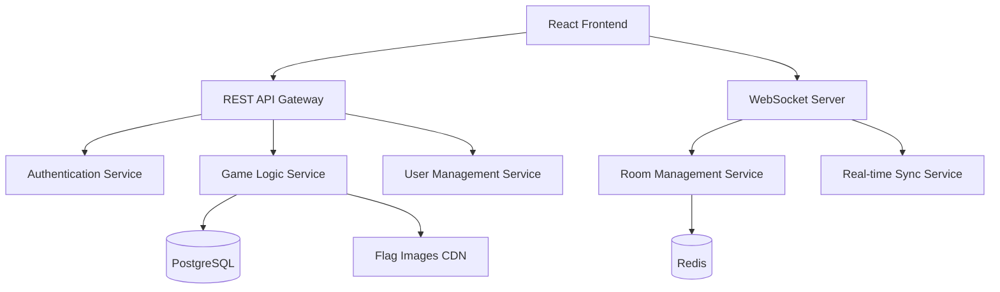

# Design Document

## Overview

The Flag Guessing Game is a web-based application built with a React frontend and Node.js backend, featuring real-time multiplayer capabilities through WebSocket connections. The system supports three distinct game modes with progressive difficulty scaling, comprehensive scoring systems, and persistent user data management.

## Architecture

### High-Level Architecture



### Technology Stack

- **Frontend**: React with TypeScript, Socket.io-client for real-time features
- **Backend**: Node.js with Express, Socket.io for WebSocket handling
- **Database**: PostgreSQL for persistent data, Redis for caching and real-time state
- **Image Storage**: CDN (AWS CloudFront/S3) for flag images
- **Authentication**: JWT-based authentication with optional OAuth integration

## Components and Interfaces

### Frontend Components

#### Core Game Components
- `GameBoard`: Main game interface displaying flag and choices
- `Timer`: Countdown timer with visual progress indicator
- `ScoreDisplay`: Real-time score and statistics display
- `ChoiceButton`: Interactive answer selection buttons
- `ResultFeedback`: Immediate answer feedback with animations

#### Mode-Specific Components
- `SinglePlayerGame`: Level progression interface
- `TimeAttackGame`: Time-based challenge interface  
- `MultiplayerRoom`: Real-time multiplayer game interface
- `RoomLobby`: Pre-game lobby for multiplayer setup

#### Navigation and UI
- `GameModeSelector`: Main menu for mode selection
- `Leaderboard`: Ranking display with filtering options
- `UserProfile`: Player statistics and achievements
- `Settings`: Game preferences and configuration

### Backend Services

#### Game Logic Service
```typescript
interface GameService {
  createGame(mode: GameMode, settings: GameSettings): Game
  generateQuestion(difficulty: number, excludeCountries: string[]): Question
  validateAnswer(questionId: string, answer: number, responseTime: number): AnswerResult
  calculateScore(baseScore: number, level: number, timeBonus: number): number
}
```

#### Room Management Service
```typescript
interface RoomService {
  createRoom(hostId: string, settings: RoomSettings): Room
  joinRoom(roomId: string, playerId: string): JoinResult
  startGame(roomId: string): void
  broadcastQuestion(roomId: string, question: Question): void
  handleAnswer(roomId: string, playerId: string, answer: Answer): void
}
```

#### User Management Service
```typescript
interface UserService {
  createUser(username: string): User
  updateStats(userId: string, gameResult: GameResult): void
  getLeaderboard(timeframe: TimeFrame, limit: number): LeaderboardEntry[]
  getUserStats(userId: string): UserStats
}
```

## Data Models

### Core Entities

#### User Model
```typescript
interface User {
  id: string
  username: string
  avatarUrl?: string
  createdAt: Date
  stats: UserStats
}

interface UserStats {
  totalGames: number
  totalCorrect: number
  bestStreak: number
  averageResponseTime: number
  highestLevel: number
  totalScore: number
}
```

#### Game Model
```typescript
interface Game {
  id: string
  mode: 'single' | 'timeattack' | 'multiplayer'
  settings: GameSettings
  status: 'waiting' | 'active' | 'completed'
  createdBy: string
  createdAt: Date
  startedAt?: Date
  endedAt?: Date
}

interface GameSettings {
  maxPlayers?: number
  timeLimit?: number
  roundCount?: number
  difficultyProgression: boolean
}
```

#### Question Model
```typescript
interface Question {
  id: string
  gameId: string
  round: number
  correctCountry: Country
  choices: Country[]
  timeLimit: number
  createdAt: Date
}

interface Country {
  code: string
  name: string
  imageUrl: string
  region: string
  colors: string[]
  difficulty: number
}
```

#### Room Model
```typescript
interface Room {
  id: string
  gameId: string
  hostUserId: string
  maxPlayers: number
  currentPlayers: Player[]
  state: 'lobby' | 'playing' | 'finished'
  currentQuestion?: Question
  scores: Record<string, number>
}

interface Player {
  userId: string
  username: string
  isReady: boolean
  score: number
  correctAnswers: number
}
```

### Database Schema

#### PostgreSQL Tables
```sql
-- Users table
CREATE TABLE users (
  id UUID PRIMARY KEY DEFAULT gen_random_uuid(),
  username VARCHAR(50) UNIQUE NOT NULL,
  avatar_url TEXT,
  created_at TIMESTAMP DEFAULT NOW(),
  total_games INTEGER DEFAULT 0,
  total_correct INTEGER DEFAULT 0,
  best_streak INTEGER DEFAULT 0,
  highest_level INTEGER DEFAULT 0,
  total_score BIGINT DEFAULT 0
);

-- Countries/Flags table
CREATE TABLE flags (
  country_code VARCHAR(3) PRIMARY KEY,
  country_name VARCHAR(100) NOT NULL,
  image_url TEXT NOT NULL,
  region VARCHAR(50),
  colors TEXT[],
  difficulty_level INTEGER DEFAULT 1,
  updated_at TIMESTAMP DEFAULT NOW()
);

-- Games table
CREATE TABLE games (
  id UUID PRIMARY KEY DEFAULT gen_random_uuid(),
  mode VARCHAR(20) NOT NULL,
  settings JSONB,
  status VARCHAR(20) DEFAULT 'waiting',
  created_by UUID REFERENCES users(id),
  created_at TIMESTAMP DEFAULT NOW(),
  started_at TIMESTAMP,
  ended_at TIMESTAMP
);

-- Game results table
CREATE TABLE game_results (
  id UUID PRIMARY KEY DEFAULT gen_random_uuid(),
  game_id UUID REFERENCES games(id),
  user_id UUID REFERENCES users(id),
  score INTEGER NOT NULL,
  correct_answers INTEGER NOT NULL,
  total_questions INTEGER NOT NULL,
  completion_time INTEGER,
  created_at TIMESTAMP DEFAULT NOW()
);
```

#### Redis Data Structures
```
// Active rooms
rooms:{roomId} -> Room object (hash)
room_players:{roomId} -> Set of player IDs
room_scores:{roomId} -> Sorted set of player scores

// Real-time leaderboards
leaderboard:daily -> Sorted set (score, userId)
leaderboard:weekly -> Sorted set (score, userId)
leaderboard:alltime -> Sorted set (score, userId)

// Game sessions
session:{sessionId} -> Game state object
user_session:{userId} -> Current session ID
```

## Error Handling

### Client-Side Error Handling
- Network connectivity issues with automatic retry logic
- WebSocket disconnection with graceful reconnection
- Invalid user input validation with immediate feedback
- Image loading failures with fallback placeholders
- Timeout handling for slow responses

### Server-Side Error Handling
- Database connection failures with connection pooling
- Redis cache unavailability with graceful degradation
- Invalid game state transitions with state validation
- Concurrent access conflicts with optimistic locking
- Rate limiting for API endpoints and WebSocket events

### Error Response Format
```typescript
interface ErrorResponse {
  error: {
    code: string
    message: string
    details?: any
  }
  timestamp: string
  requestId: string
}
```

## Testing Strategy

### Unit Testing
- Game logic functions (score calculation, question generation)
- Data validation and transformation utilities
- Individual React components with Jest and React Testing Library
- Service layer methods with mocked dependencies

### Integration Testing
- API endpoints with supertest
- Database operations with test database
- WebSocket event handling with socket.io-client
- Redis operations with test Redis instance

### End-to-End Testing
- Complete game flows using Playwright or Cypress
- Multiplayer scenarios with multiple browser instances
- Performance testing under concurrent load
- Cross-browser compatibility testing

### Performance Testing
- Load testing for concurrent multiplayer games
- Image loading and caching performance
- Database query optimization validation
- WebSocket connection scaling tests

## Security Considerations

### Authentication & Authorization
- JWT token validation for all protected endpoints
- Rate limiting on authentication attempts
- Session management with secure token storage
- Optional OAuth integration for social login

### Game Integrity
- Server-side answer validation to prevent cheating
- Request rate limiting to prevent spam
- Input sanitization for user-generated content
- Secure WebSocket connections with authentication

### Data Protection
- User data encryption at rest
- Secure transmission with HTTPS/WSS
- Privacy-compliant user data handling
- Audit logging for sensitive operations

## Performance Optimization

### Frontend Optimization
- Image preloading for next 2-3 questions
- Component memoization for expensive renders
- Lazy loading for non-critical components
- Service worker for offline flag caching

### Backend Optimization
- Database query optimization with proper indexing
- Redis caching for frequently accessed data
- Connection pooling for database and Redis
- CDN integration for static flag images

### Real-time Performance
- WebSocket connection pooling and management
- Efficient room state synchronization
- Optimized message broadcasting
- Connection cleanup and resource management